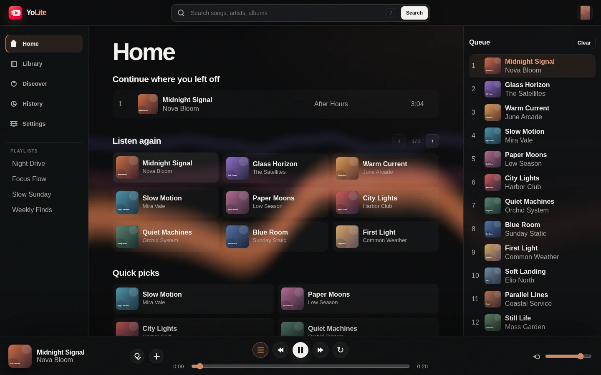
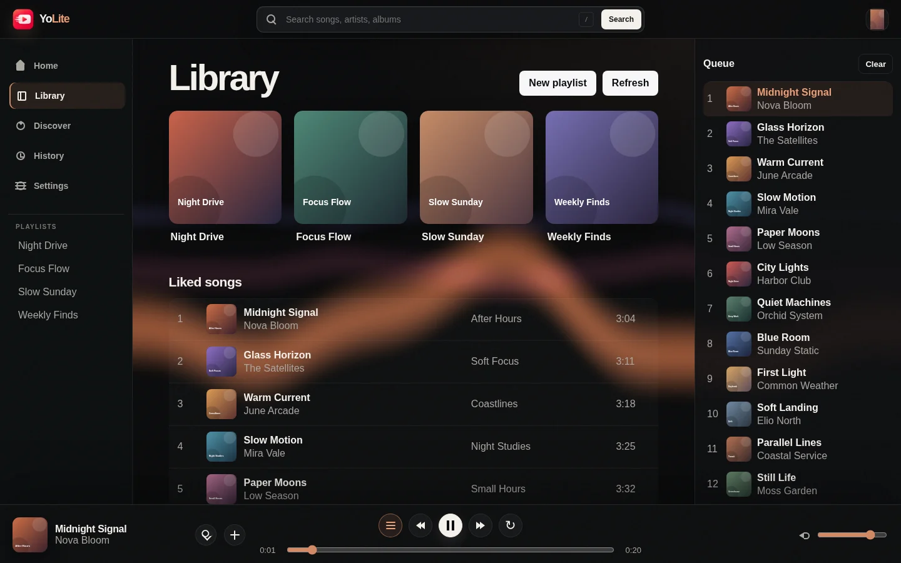
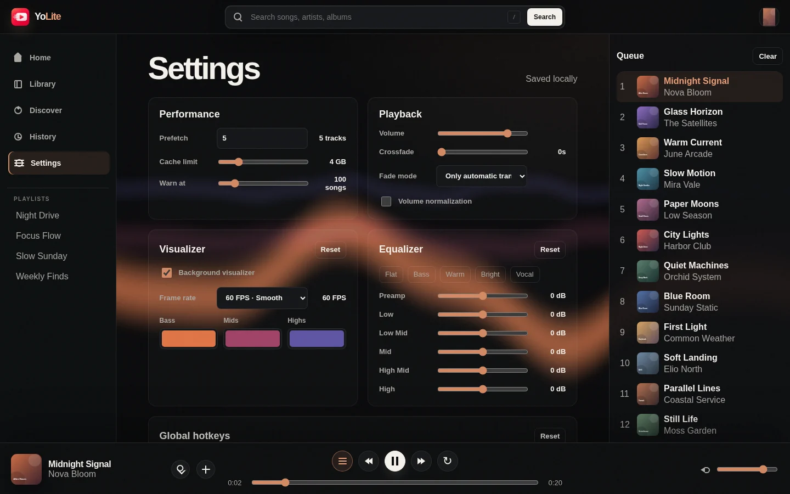

# Yolite

Yolite is a lightweight, open-source YouTube Music desktop client built with Tauri, Rust, and the system webview. It keeps the familiar parts of a full music client—personalized shelves, library access, playlists, queue management, native playback, global controls, and a reactive visualizer—without shipping Electron.

> Yolite is an unofficial client and is not affiliated with YouTube or Google.



## Highlights

- Native Tauri desktop shell with a Rust backend
- Personalized Home, Library, Discover, History, and playlist views
- Cookie-backed YouTube Music sessions with browser and in-app import paths
- Native playback through `mpv` and stream resolution through `yt-dlp`
- Queue controls, seeking, volume, loop modes, crossfade, and a six-band equalizer
- WebGL visualizer driven by real audio telemetry
- Configurable visualizer frame rate and bass, mids, and highs colors
- Global hotkeys, compact always-on-top player, Discord presence, and phone controls
- Declarative local plugins for themes and discovery categories
- Browser prototype for quick interface development and end-to-end tests

## Screenshots

Screenshots use a fictional account, generated artwork, and placeholder playlists. No real account or listening data is included.

<table>
  <tr>
    <td width="50%">
      
      <br><strong>Personalized library</strong>
    </td>
    <td width="50%">
      
      <br><strong>Playback and visualizer controls</strong>
    </td>
  </tr>
</table>

## Requirements

### Desktop development

- Node.js 22+
- npm
- Stable Rust toolchain
- Tauri 2 system dependencies for your platform
- `mpv` for native playback
- Python 3.9+ for `youtube-dl-exec` installation and update support

`npm install` downloads a project-local `yt-dlp` binary through `youtube-dl-exec`. Yolite also checks common system locations for `yt-dlp`.

Linux is the primary desktop target. Current native playback controls use Unix `mpv` IPC.

### Browser prototype

The browser prototype needs Node.js 22+ and npm. It uses the Node backend instead of the Tauri command layer.

## Quick start

### Desktop app

```bash
npm install
npm run desktop:dev
```

Build native packages with:

```bash
npm run desktop:build
```

### Install and update on Linux

GitHub Releases provide a signed AppImage. AppImage installs can check for updates in Settings, verify the release signature, replace the application, and restart without a Yolite server.

Arch Linux and CachyOS users can install the `yolite-bin` AUR package once it is published:

```bash
paru -S yolite-bin
```

That package installs Yolite under `/opt` and deliberately leaves updates to pacman and the AUR helper (`paru -Syu` or `yay -Syu`). Package-managed files are never overwritten by the in-app updater.

### Browser prototype

```bash
npm install
npm start
```

Open the local URL printed by the server.

## Account sessions

Yolite can run without an account for public search and playback. Importing a session enables personalized Home and Library content.

Recommended flow:

1. Sign in to YouTube Music in your normal browser.
2. Open Yolite Settings.
3. Select the browser profile under Session.
4. Choose **Import browser session**.
5. Refresh Library after Yolite confirms the session.

The desktop app also provides an in-app login window. Manual cookie headers and Netscape `cookies.txt` exports are supported when automatic import is unavailable.

If one Google login owns multiple YouTube identities, open `https://www.youtube.com/account_advanced` while using the intended identity. Yolite accepts:

- Channel ID for public channel playlist discovery
- Numeric Brand Account ID as the YouTube Music user selector

Session data is stored locally:

```text
~/.config/yolite/config.json
```

Set `YOLITE_CONFIG=/path/to/config.json` to use another configuration file. Never commit this file or exported cookies.

## Playback and visualizer

Desktop playback runs outside the webview through `mpv`. This avoids binding decoding and audio output to the interface process.

The background visualizer uses:

- FFmpeg audio statistics from the native `mpv` filter chain
- Web Audio frequency data in browser mode
- One low-power WebGL draw call per rendered frame
- Automatic suspension while paused, hidden, or disabled
- Selectable 15, 30, 60, or 120 FPS limits
- User-defined bass, mids, and highs colors stored in local settings

Disabling the visualizer also removes native analysis filters, so unused effects do not consume processing time.

## Plugins and themes

Desktop plugins live under `~/.config/yolite/plugins`. Each plugin has its own directory:

```text
plugins/
  warm-studio/
    plugin.json
    theme.css
```

Example `plugin.json`:

```json
{
  "name": "Warm studio",
  "version": "1.0.0",
  "description": "Warm neutral surfaces and extra focus categories",
  "discoverCategories": ["Deep focus", "Late-night jazz"]
}
```

`theme.css` can override Yolite CSS variables and component styles. Plugins are declarative and do not execute JavaScript. CSS still changes the interface, so install plugins only from sources you trust.

## Project structure

The Rust backend is split by ownership so changes stay focused and reviewable:

- `src-tauri/src/lib.rs` composes the Tauri application and registers commands.
- `src-tauri/src/models.rs` contains shared command payloads and application state.
- `src-tauri/src/config.rs` owns local configuration and cookie normalization.
- `src-tauri/src/youtube.rs` owns YouTube Music requests, parsing, and account commands.
- `src-tauri/src/playback.rs` owns `mpv`, `yt-dlp`, equalizer, and visualizer telemetry.
- `src-tauri/src/servers.rs` owns loopback streaming and the phone controller server.
- `src-tauri/src/desktop.rs`, `discord.rs`, `plugins.rs`, and `remote.rs` contain their named integrations.
- `src-tauri/src/updater.rs` owns signed release checks and installation policy.
- `public/app.js` coordinates the interface.
- `public/visualizer.js` owns the WebGL renderer.
- `src/server.js` supports the local browser prototype.
- `tests/` contains Playwright regression tests.

Put new code in the module that owns its state or external boundary. Keep `lib.rs` limited to application composition.

## Development

Run all current checks before opening a pull request:

```bash
(cd src-tauri && cargo fmt -- --check)
(cd src-tauri && cargo test)
node --check public/app.js
node --check public/visualizer.js
npm run test:e2e
```

Keep commits narrow and independently buildable. Separate structural refactors, behavior changes, and documentation when practical.

Release maintainers should follow [the signing and publishing guide](docs/RELEASING.md). Releases and update metadata are hosted entirely by GitHub; the project does not require a separate update server.

## Privacy and security

- Account cookies stay in the local Yolite configuration file.
- Temporary `yt-dlp` cookie files are removed after use.
- The phone controller uses a random private token, but it is still reachable on the local network while enabled.
- Plugin CSS is local and declarative.
- Yolite does not include its own analytics service.

Treat session cookies and phone-controller QR codes as secrets.

## Known boundaries

YouTube Music uses private, evolving endpoints. Upstream changes can break parsing or playback without notice. Linux receives the most testing. Windows and macOS packaging still need broader contributor testing.

## License

Yolite is available under the [MIT License](LICENSE).
